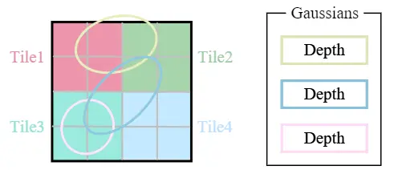
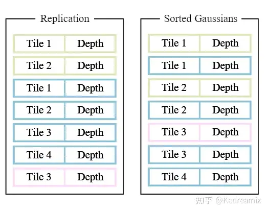

WebGPU WebGPU Gaussian Splat Viewer Instructions
==========================================================

**This is due Sunday, October 29th at 11:59 PM.**

In this project, you will implement the 3D Gaussian Splat Viewer. You are given some pretrained Gaussian files and basic loading function, as well as some GUIs including file loading and renderer switch.

## Contents

- `src/` contains all the TypeScript and WGSL code for this project. This contains several subdirectories:
  - `renderers/` defines the different renderers in which you will implement gaussian renderer.
  - `shaders/` contains the WGSL files that are interpreted as shader programs at runtime. 
  - `camera/` includes camera controls, camera file loading.
  - `utils/` includes PLY file loading, utility functions for debugging. 
- `public/scenes/` some sample pretrained gaussian files.

## Running the code

Follow these steps to install and view the project:
- Clone this repository
- Download and install [Node.js](https://nodejs.org/en/)
- Run `npm install` in the root directory of this project to download and install dependencies
- Run `npm run dev`, which will open the project in your browser
  - The project will automatically reload when you edit any of the files

### Notes:

- The project will **not** work immediately after being cloned and set up as there are some tasks for you to complete to get it up and running (see [the project instructions](#part-1-implement-the-different-rendering-methods)).
- Browsers and GPUs
  - This project requires a WebGPU-capable browser. Ensure that you can see the Sponza scene being renderered using this [WebGPU test](https://toji.github.io/webgpu-test/).
    - Google Chrome seems to work best on all platforms.
    - Try [Google Chrome Canary](https://www.google.com/chrome/canary/) for the latest updates.
  - If you have problems running the starter code, use Chrome and make sure you have updated your browser and video drivers.
  - Remember to follow steps from [Project 0](https://github.com/CIS5650-Fall-2024/Project0-Getting-Started/blob/main/INSTRUCTION.md#part-23-project-instructions---webgpu) if needed.
- Ensure that the `Adapter Info -> Description` on https://webgpureport.org/, is your main GPU. Often your low-powered GPU will be selected as default. To make a permanent switch, use your OS's GPU Settings to make the GPU default for your browser.

### Debugging Tools

- You can use the standard console debugger in the browser’s developer tools to inspect and debug your code.
- Additionally, you can utilize the [Chrome WebGPU Developer Tools extension](https://chromewebstore.google.com/detail/webgpu-devtools/ckabpgjkjmbkfmichbbgcgbelkbbpopi) to capture frames and inspect detailed GPU-related information.
  - Once you have installed the extension in Chrome, access the WebGPU panel by navigating to: **Developer Tools -> More Tools -> WebGPU**.
  - Please note that the extension is currently in an unstable state. If the reset button doesn't function as expected, try reopening the tab to refresh the panel.

### GitHub Pages setup

Since this project uses WebGPU, it is easy to deploy it on the web for anyone to see. To set this up, do the following:
- Go to your repository's settings
- Go to the "Pages" tab
- Under "Build and Deployment", set "Source" to "GitHub Actions"

You will also need to go to the "Actions" tab in your repository and enable workflows there.

Once you've done those steps, any new commit to the `main` branch should automatically deploy to the URL `<username>.github.io/<repo_name>`.

## Requirements

**Ask on Ed Discussion for any clarifications.**

In this project, you are given code for:
- ply scene loading
- camera json file loading
- radix sort compute shader
- point cloud renderer
- skeleton code for gaussian renderer

For editing the project, you will want to use [Visual Studio Code](https://code.visualstudio.com/). Once you've installed VSCode, you can open the root folder of this project using "File > Open Folder..." to start coding. You may also find [this extension](https://marketplace.visualstudio.com/items?itemName=PolyMeilex.wgsl) useful for highlighting WGSL syntax.

WebGPU errors will appear in your browser's developer console (Ctrl + Shift + J for Chrome on Windows). Unlike some other graphics APIs, WebGPU error messages are often very helpful, especially if you've labeled your various pipeline components with meaningful names. Be sure to check the console whenever something isn't working correctly.

### Part 1: Understanding 3D Gaussian Point Cloud & Add MVP calculation

To start off, read over the [paper](https://repo-sam.inria.fr/fungraph/3d-gaussian-splatting/) for some basic ideas. Although we don't focus on training part of the algorithm, it still knowledge you can learn for your good. Then read over point cloud renderer, add MVP calculation to the vertex shader. After that, you can see point cloud being rendered to screen. 

### Part 2: Gaussian Renderer

Pipeline: 

  - Loading 3D gaussian data into GPU (this part is done for you, see `PointCloud` in load.ts)
  - Preprocess 3D gaussian data
    -  Do a simple view frustum culling to keep only visible gaussians (you may want to keep the bounding box to be slightly larger than actual frustum)
    -  Compute 3D covariance based on rotation and scale, also user input gaussian multipler. (see [post](https://github.com/kwea123/gaussian_splatting_notes) on 1.1 section)
    -  Compute 2D conic, maximum radius, and <b>maximum quad size in NDC</b> (see [post](https://github.com/kwea123/gaussian_splatting_notes) on 1.1 section)
    - Store essential 2D gaussian data to later rasteriation pipeline
    - Add key_size, indices, and depth to sorter. 
  - Sort Gaussians based on depth
  - Render the 2D splat on quad utlizing indirect draw call (instance count from process step) in sorted order.

Note: original paper do tile-based depth sorting for each tile and add on opacity till opacity is near 1.0, here we utiized the standard rasterization pipeline, so we render all of them all together. 

### Part 2: Extra Credit: Optimization

Follow the [paper](https://github.com/kwea123/gaussian_splatting_notes) implementation using tile-based depth sorting. Then composite the final image using compute shader. 

## Performance Analysis

## Base Code Walkthrough

In general, you can search for comments containing "Task" to see the most important/useful parts of the base code.

## README

Replace the contents of `README.md` with the following:
- A brief description of your project and the specific features you implemented
- At least one screenshot of your project running
- A 30+ second video/gif of your project running showing all features (even though your demo can be seen online, it may not run on all computers, while a video will work everywhere)
- A link to your project's live website (see [GitHub Pages setup](#github-pages-setup))

## Submit

Open a GitHub pull request so that we can see that you have finished. The title should be "Project 4: YOUR NAME". The template of the comment section of your pull request is attached below, you can do some copy and paste:

- Repo Link
- Briefly mention features that you've completed, especially those bells and whistles you want to highlight:
  - Feature 0
  - Feature 1
  - ...
- Feedback on the project itself, if any.

### Third-Party Code Policy

- Use of any third-party code must be approved by asking on Ed Discussion.
- If it is approved, all students are welcome to use it. Generally, we approve use of third-party code that is not a core part of the project. For example, for the path tracer, we would approve using a third-party library for loading models, but would not approve copying and pasting a CUDA function for doing refraction.
- Third-party code **MUST** be credited in README.md.
- Using third-party code without its approval, including using another student's code, is an academic integrity violation, and will, at minimum, result in you receiving an F for the semester.